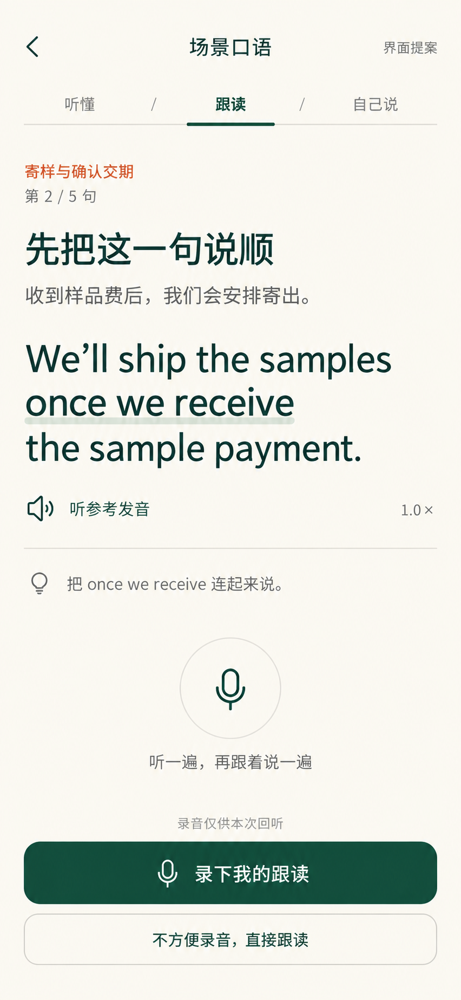
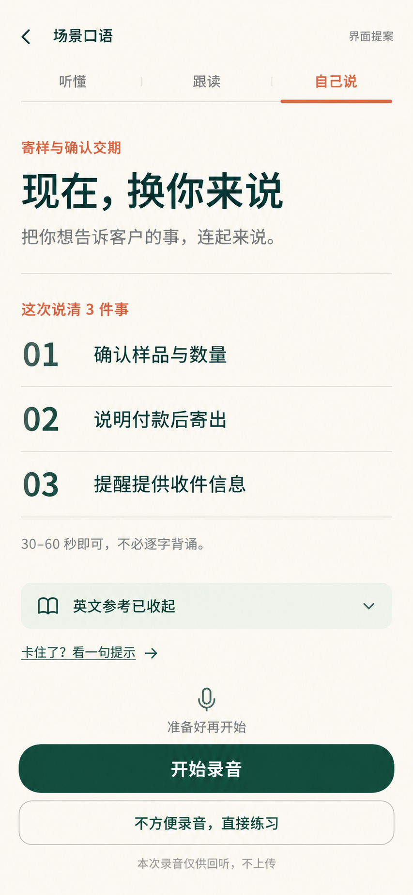
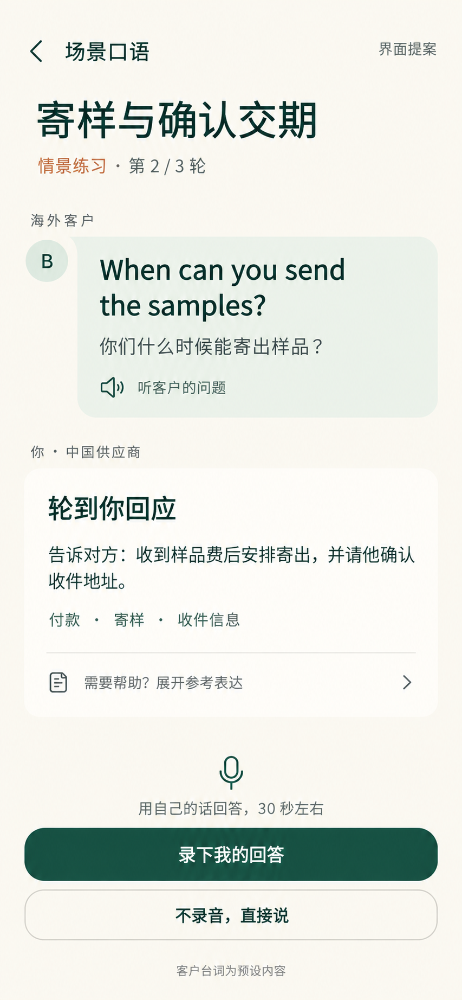

# 场景口语训练 · 设计评审

2026-09-29 · **用户已选择方向 3；本地实现与测试完成，尚未部署。**

[阅读完整 PRD](PRD.md) · [查看视觉生成提示](UI-PROMPTS.md)

目标：每次约 8 分钟，把常见表达连起来说。首批建议覆盖 8 个日常场景、4 个外贸场景。

当前流程：优先关联已学表达 → 听对方问题 → 看中文任务自己回应 → 录音回听 → 可选上传转写 / 手填回答 → 核对文字 → AI 表达建议 → 再说一次 → 将确认练过的难句加入日常复习。也可跳过 AI，直接自评继续。共 12 个场景、每场景 3 轮，对方台词仍为预设内容。

## UI 方向 1

以一条表达为焦点，适合听懂与跟读阶段。图片中的第 2 / 5 句为布局示例，最终内容顺序以具体场景包为准。

## UI 方向 2

突出沟通目标，英文参考默认隐藏，适合自己说阶段。录音和无录音练习都可完成；用过提示后不能自评为本次独立完成。

## UI 方向 3

突出对方的问题和自己的回应，现已被用户选为首版实现方向。画面中客户台词为预设内容，不是实时 AI 或真实客户消息。

## 建议与评审重点

早期建议组合方向 1 与方向 2；用户后续选择方向 3，实施以此为准。它们共用现有米白、深绿、橙色体系；使用 Product Design 流程并通过内置 Image Gen 生成，附带实际产品历史截图作为样式参考。

请重点判断：这个练习过程是否愿意每天用一次；是否需要录音回听；是否希望更快进入对话；日常与外贸的比例是否合适。

三张图片保留为概念参考；当前实现在实际浏览器中核对，见根目录 `design-qa.md`。真实 iPhone 的录音和听感仍需上线后验收。配置与功能边界见 `docs/runbooks/scenario-and-natural-speech.md`。
